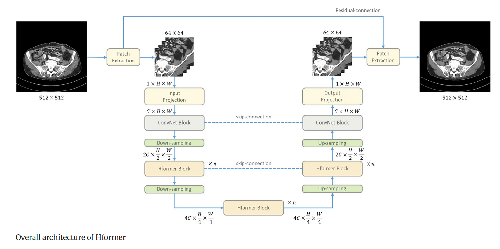
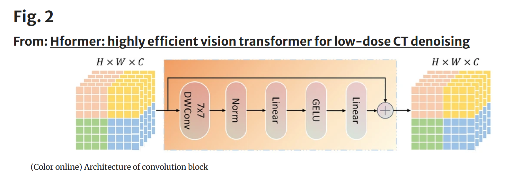
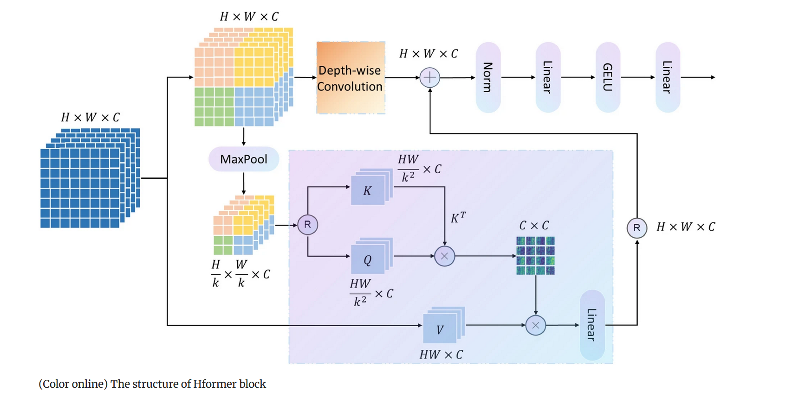
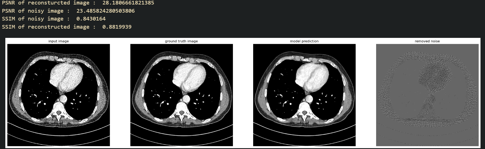
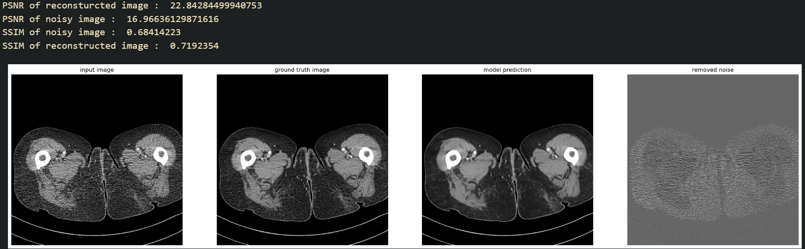
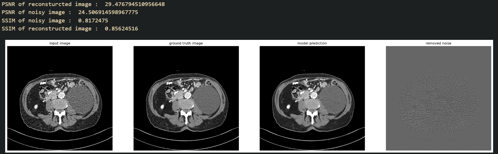

# HFormer-Low-Dose-CT-Denoiser
Unofficial implementation of the paper "Hformer: highly efficient vision transformer for low-dose CT denoising". Link to original paper : https://link.springer.com/article/10.1007/s41365-023-01208-0

There are several assumptions made here, such as C is assumed to be 64, K is assumed to be 2, n is taken to be 1, linear is taken to be 1x1 convolutions, etc.

## Dataset used : AAPM Low Dose CT Grand Challenge

Link : The 2016 NIH-AAPM-Mayo Clinic Low Dose CT Grand Challenge by Mayo Clinic
[https://www.aapm.org/GrandChallenge/LowDoseCT/](https://www.aapm.org/GrandChallenge/LowDoseCT/)

## Results

## How to use

In train/hformer_train.py, set the dataset path and model output / history path.
In the test/hformer_test.ipynb file, set the correct path to the .k5 file.

## References used

* [full-preprocessing-tutorial](https://www.kaggle.com/gzuidhof/full-preprocessing-tutorial)
* [RED-CNN](https://github.com/SSinyu/RED-CNN)
